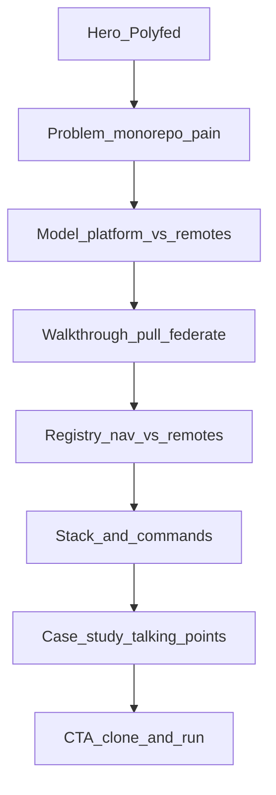

# Polyfed presentation website

## Defaults (locked)

- **Where:** [`apps/www`](apps/www) — standalone Vite + React app, **not** an MF remote, **not** registered in [`remotes.json`](packages/mf-config/remotes.json).
- **Depth:** Comprehensive **story + interactive walkthrough UI** (diagrams, step scrubber, copyable commands). CTA to clone repo and `bun run dev`. **No** embedded live shell/federation (fragile for demos; shell stays the runtime demo).
- **Port:** `4300` on `127.0.0.1` (avoids shell `4200` / remotes `51xx`).
- **Deploy target later:** static `vite build` → GitHub Pages (wire workflow after site ships).

## Design direction (brand module)

**Voice words:** warehouse · permissioned · stencil.  
**Named lane:** cargo-dock logistics (not Stripe-minimal, not editorial magazine, not purple SaaS).  
**Physical object:** stamped shipping crate / pick ticket.

| Token   | Choice                                                                                                                    |
| ------- | ------------------------------------------------------------------------------------------------------------------------- |
| Display | **Oxanium** (Google Fonts) — technical, not Inter/Space Grotesk                                                           |
| Body    | **Source Sans 3** — readable, not on reflex-reject list                                                                   |
| Mono    | **JetBrains Mono** — commands / JSON                                                                                      |
| Color   | Ink `#0B1220`, paper `#F4F0E6`, **safety amber** `#F5A524` commit accent, steel `#8B9BB4`                                 |
| Motion  | 2–3 purposeful: hero crate stagger, walkthrough step crossfade, diagram line draw — all gated by `prefers-reduced-motion` |

Hero rules (existing frontend-design constraints): one composition, brand “Polyfed” as hero signal, one headline, one supporting line, one CTA group; **no** card grid in hero; full-bleed atmosphere (subtle dock grid / SVG crates), not inset media cards.

## Information architecture (single page + anchors)



Content sourced from current [`README.md`](README.md) (problem table, architecture, commands, auth note, case-study bullets) — rewritten for scannable web copy, not a README dump.

## Interactive “demo” (without live MF)

1. **Walkthrough scrubber** — steps: clone platform → `pull-remote` → `bun run dev` → shell loads remote / offline if missing. URL query `?step=1..n` (Web Interface Guidelines: URL reflects state).
2. **Architecture diagram** — SVG/CSS: platform box, remotes as crates, arrows for git vs `entry.prod`; toggle Local / Prod / Offline states (mirrors real checkout semantics).
3. **Command panels** — copyable `bun run …` blocks with `aria-live` on “Copied…”.
4. **Contrast strip** — monorepo vs Polyfed (short, not a feature wall).

## App structure (feature-lite, ponytail)

Keep thin — presentation site, not enterprise feature tree:

```
apps/www/
  index.html
  package.json          # @react-mfe/www, port 4300 via vite config
  vite.config.mts
  src/
    main.tsx
    styles.css          # CSS vars + Tailwind via @react-mfe/ui or local @import
    App.tsx             # page shell + skip link + sections
    sections/           # hero, problem, model, walkthrough, registry, stack, case, cta
    components/         # StepScrubber, ArchDiagram, CopyCommand, SiteNav
    content.ts          # copy + steps (plain data, no CMS)
```

- Logic in small hooks only where needed (`use-walkthrough-steps.ts` for URL sync).
- No Ant Design dependency on www (avoid shell chrome look); semantic HTML + Tailwind.
- Reuse [`@react-mfe/ui/styles/tailwind.css`](packages/ui/src/styles/tailwind.css) **or** a local Tailwind entry with `@source` for `apps/www/src` — extend UI `@source` glob once so utilities compile.

## Workspace wiring

- Add Nx project via `package.json` `nx` block (same pattern as shell/remotes).
- Root script: `"www": "nx run @react-mfe/www:dev"` (or `bun run www`).
- Do **not** add to `remotes.json` / `nav.json` / shell sider.
- [`scripts/dev-all.mjs`](scripts/dev-all.mjs) stays shell+remotes only (www is optional second terminal).

## Accessibility / guidelines checklist (build-in)

- Skip link, hierarchical headings, `<main>` / `<nav>` / `<section>`
- Focus-visible rings; no `outline-none` without replacement
- `prefers-reduced-motion` for all motion
- Copy buttons: `aria-label`, `aria-live="polite"`
- Headings: `text-wrap: balance`; typography: real ellipsis/quotes where needed
- Images/SVG: dimensions / `aria-hidden` on decorative crates

## Out of scope (YAGNI)

- Live iframe of shell / federated remotes
- CMS, i18n, blog, auth on www
- Redesigning the shell Ant Design app
- Post-pull doctor / more polyrepo toolkit work

## Ship order

1. Scaffold `apps/www` + Tailwind source + root script
2. Tokens, fonts, global layout + SiteNav
3. Hero → Problem → Model sections
4. Walkthrough + ArchDiagram (URL `?step=`)
5. Registry / Stack / Case / CTA
6. Reduced-motion + a11y pass against Web Interface Guidelines
7. Optional follow-up: GitHub Pages workflow for `nx run @react-mfe/www:build`
